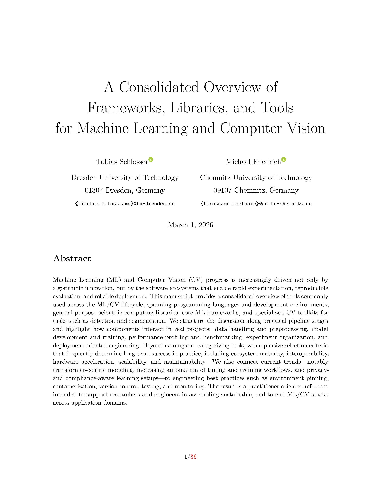

A Consolidated Overview of Frameworks, Libraries, and Tools for Machine Learning and Computer Vision
====================================================================================================


By Tobias Schlosser and Michael Friedrich


---

Machine Learning (ML) and Computer Vision (CV) progress is increasingly driven not only by algorithmic innovation, but by the software ecosystems that enable rapid experimentation, reproducible evaluation, and reliable deployment. This manuscript provides a consolidated overview of tools commonly used across the ML/CV lifecycle, spanning programming languages and development environments, general-purpose scientific computing libraries, core ML frameworks, and specialized CV toolkits for tasks such as detection and segmentation. We structure the discussion along practical pipeline stages and highlight how components interact in real projects: data handling and preprocessing, model development and training, performance profiling and benchmarking, experiment organization, and deployment-oriented engineering. Beyond naming and categorizing tools, we emphasize selection criteria that frequently determine long-term success in practice, including ecosystem maturity, interoperability, hardware acceleration, scalability, and maintainability. We also connect current trends—notably transformer-centric modeling, increasing automation of tuning and training workflows, and privacy- and compliance-aware learning setups—to engineering best practices such as environment pinning, containerization, version control, testing, and monitoring. The result is a practitioner-oriented reference intended to support researchers and engineers in assembling sustainable, end-to-end ML/CV stacks across application domains.

---


Please cite the paper in your publications if it helps your research:

```
@article{SF2026_frameworks,
  title={A Consolidated Overview of Frameworks, Libraries, and Tools for Machine Learning and Computer Vision},
  author={Schlosser, Tobias and Friedrich, Michael},
  year={2026}
}
```


Compilation
-----------

```
make clean && make
```


Example
-------



