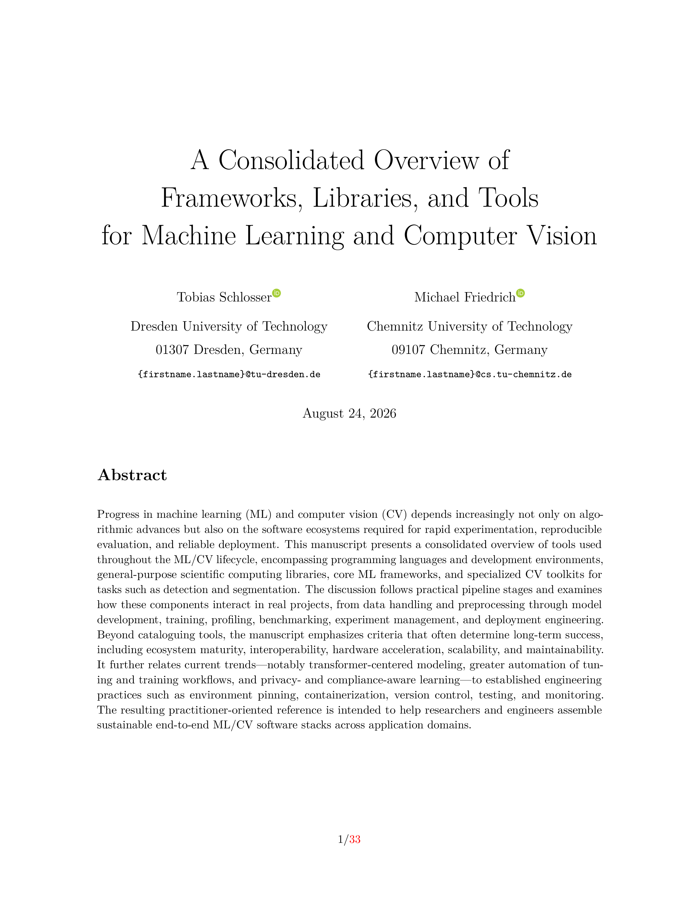

A Consolidated Overview of Frameworks, Libraries, and Tools for Machine Learning and Computer Vision
====================================================================================================


By Tobias Schlosser and Michael Friedrich


---

Progress in machine learning (ML) and computer vision (CV) depends increasingly not only on algorithmic advances but also on the software ecosystems required for rapid experimentation, reproducible evaluation, and reliable deployment. This manuscript presents a consolidated overview of tools used throughout the ML/CV lifecycle, encompassing programming languages and development environments, general-purpose scientific computing libraries, core ML frameworks, and specialized CV toolkits for tasks such as detection and segmentation. The discussion follows practical pipeline stages and examines how these components interact in real projects, from data handling and preprocessing through model development, training, profiling, benchmarking, experiment management, and deployment engineering. Beyond cataloguing tools, the manuscript emphasizes criteria that often determine long-term success, including ecosystem maturity, interoperability, hardware acceleration, scalability, and maintainability. It further relates current trends—notably transformer-centered modeling, greater automation of tuning and training workflows, and privacy- and compliance-aware learning—to established engineering practices such as environment pinning, containerization, version control, testing, and monitoring. The resulting practitioner-oriented reference is intended to help researchers and engineers assemble sustainable end-to-end ML/CV software stacks across application domains.

---


Please cite the paper in your publications if it helps your research:

```
@article{SF2026_frameworks,
  title={A Consolidated Overview of Frameworks, Libraries, and Tools for Machine Learning and Computer Vision},
  author={Schlosser, Tobias and Friedrich, Michael},
  year={2026}
}
```


Compilation
-----------

```
make clean && make
```


The manuscript
--------------



